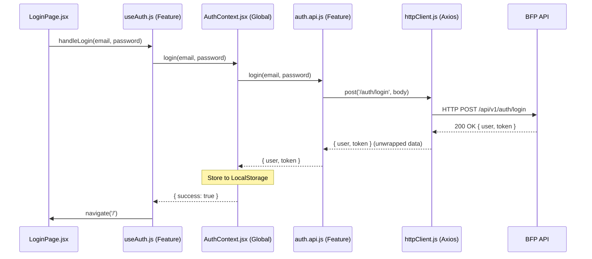

# Auth Feature Architecture & Data Flow

This document details the authentication lifecycle, request infrastructure, and token management strategy for BFPACS.

## 1. Authentication Lifecycle

The application follows a **Re-hydration & Proactive Verification** pattern:

1.  **Initial Mount:** `src/context/AuthContext/AuthContext.jsx` reads `bfp_user` and `bfp_token` from `localStorage`.
2.  **Immediate Trust:** The UI is immediately rendered with the cached data (avoiding layout shifts).
3.  **Proactive Refresh:** The context asynchronously calls `/auth/me` via `usersApi.me()` to verify the token is still valid and fetch any role updates.
4.  **Auto-Purge:** If the refresh fails with a `401 Unauthorized` (handled by the `httpClient.js` interceptor), local storage is cleared, and the user is redirected to `/login`.

## 2. Request Flow (Login Example)



## 3. Response & Error Handling

All responses pass through the `httpClient.js` global interceptors:

*   **200 Success:** The payload is "unwrapped" (returning `response.data` directly) for cleaner consumption in components.
*   **401 Unauthorized:** 
    *   Interpreted as "Token missing or expired".
    *   Interceptors clear `localStorage`.
    *   Force redirect to `/login` (except if already on login page).
*   **403 Forbidden:** 
    *   Interpreted as "Insufficient permissions".
    *   Passed through as a `ApiClientError`.
*   **ApiClientError:** Every error (4xx, 5xx) is normalized into this class to ensure the UI can always rely on `error.message` and `error.code`.

## 4. Token Management

*   **Storage:** Tokens are stored in **LocalStorage** (`bfp_token`).
*   **Injection:** The `httpClient.js` request interceptor automatically injects the `Authorization: Bearer <token>` header into every request if a token is present.
*   **Decoupling:** Feature code (`auth.api.js`, `fleet.api.js`, etc.) never manages tokens. They only track paths and payloads; the security layer is completely handled by the central `httpClient`.

## 5. Feature Structure

```text
src/features/auth/
├── api/          # auth.api.js (endpoint definitions)
├── components/   # auth-related UI fragments
├── hooks/        # useAuth.js (workflow/logic extraction)
├── pages/        # LoginPage.jsx, RegisterPage.jsx
└── FEATURE_ARCH.md # Architecture reference (this file)
```
